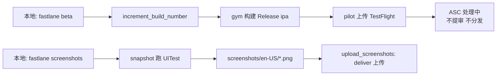

## 目标回顾

- 能做到 1：截图自动化，先跑 en-US，未来加语言改一行
- 能做到 2：只自动发 TestFlight，不自动提交审核（release 保持手动）
- 鉴权：App Store Connect API Key（.p8）

## 总体结构



两条 lane 完全独立，可以分阶段做。

---

## 阶段 1: TestFlight beta lane（优先，阻塞小）

### 1.1 ASC API Key 准备（你手工做，一次性）

步骤（fastlane 不能替代）：

1. 登录 `https://appstoreconnect.apple.com` → **Users and Access** → **Integrations** → **App Store Connect API** → **Team Keys**
2. 点 **Generate API Key**
   - Name: `FIREprint Fastlane`
   - Access: **App Manager**（最低权限，够用）
3. 下载 `AuthKey_XXXXXXXXXX.p8`（只能下载一次！丢了只能重生成）
4. 记下：**Key ID**（10 位字符）、**Issuer ID**（UUID，页面顶部）

### 1.2 文件落位

- `.p8` 文件放到 `Projects/FIREprint_App/ios_workspace/fastlane/AuthKey_XXXXXXXXXX.p8`
- 新建 [Projects/FIREprint_App/ios_workspace/fastlane/asc_api_key.json](Projects/FIREprint_App/ios_workspace/fastlane/asc_api_key.json)：
  ```json
  {
    "key_id": "XXXXXXXXXX",
    "issuer_id": "abcd1234-...-...",
    "key": "fastlane/AuthKey_XXXXXXXXXX.p8",
    "duration": 1200,
    "in_house": false
  }
  ```
- 把 `.p8` 和 `asc_api_key.json` 加到 [Projects/FIREprint_App/ios_workspace/fastlane/.gitignore](Projects/FIREprint_App/ios_workspace/fastlane/.gitignore)（**绝不进 git**）
- 提交一份 `asc_api_key.sample.json` 给后来者参考

### 1.3 修 [Projects/FIREprint_App/ios_workspace/fastlane/Appfile](Projects/FIREprint_App/ios_workspace/fastlane/Appfile)

补 `team_id`（现在是空的）：

```ruby
app_identifier "com.codearthur.matrixapps.fireprint"
apple_id "paincupid@gmail.com"
team_id "XXXXXXXXXX"  # 从 ASC 页面右上角 Membership 找
```

### 1.4 改写 [Projects/FIREprint_App/ios_workspace/fastlane/Fastfile](Projects/FIREprint_App/ios_workspace/fastlane/Fastfile)

保留已有 `upload_metadata` lane，新增：

```ruby
default_platform(:ios)

API_KEY_PATH = "fastlane/asc_api_key.json"

platform :ios do

  desc "Upload only App Store metadata"
  lane :upload_metadata do
    deliver(
      api_key_path: API_KEY_PATH,
      skip_binary_upload: true,
      skip_screenshots: true,
      force: true,
      precheck_include_in_app_purchases: false
    )
  end

  desc "Build and upload to TestFlight (internal only, no review, no external distribution)"
  lane :beta do
    next_build = latest_testflight_build_number(
      api_key_path: API_KEY_PATH,
      initial_build_number: 0
    ) + 1

    increment_build_number(
      build_number: next_build,
      xcodeproj: "FIREprint.xcodeproj"
    )

    gym(
      project: "FIREprint.xcodeproj",
      scheme: "FIREprint",
      configuration: "Release",
      export_method: "app-store",
      output_directory: "./build",
      output_name: "FIREprint.ipa",
      clean: true,
      include_bitcode: false
    )

    pilot(
      api_key_path: API_KEY_PATH,
      ipa: "./build/FIREprint.ipa",
      skip_waiting_for_build_processing: true,
      skip_submission: true,
      distribute_external: false,
      changelog: ENV["FL_CHANGELOG"] || "Internal test build"
    )
  end
end
```

**关键参数，兑现"不 release"承诺**：
- `skip_submission: true` → 不提交 App Store 审核
- `distribute_external: false` → 不分发给外部测试组
- `skip_waiting_for_build_processing: true` → 上传完就退出（ASC 处理 ~20 分钟后你自己点"添加到测试组"）

### 1.5 使用方式

```bash
cd Projects/FIREprint_App/ios_workspace
bundle exec fastlane beta
# 或自定义 changelog
FL_CHANGELOG="fix ATT cold start" bundle exec fastlane beta
```

build number 自动从 ASC 最新 +1，不会撞号。MARKETING_VERSION 仍从 `project.yml` 改（手动）。

---

## 阶段 2: 截图自动化（先 en-US，后续可扩展）

### 2.1 在 [Projects/FIREprint_App/ios_workspace/project.yml](Projects/FIREprint_App/ios_workspace/project.yml) 加 UITest target

在现有 `FIREprint` target 后面加：

```yaml
  FIREprintUITests:
    type: bundle.ui-testing
    platform: iOS
    sources:
      - path: FIREprintUITests
    dependencies:
      - target: FIREprint
    settings:
      base:
        SWIFT_VERSION: "5.9"
        PRODUCT_BUNDLE_IDENTIFIER: com.codearthur.matrixapps.fireprint.uitests
        TEST_TARGET_NAME: FIREprint
```

然后在 schemes 里给 FIREprint scheme 加 testAction 挂这个 target（xcodegen 自动处理）。

### 2.2 新建目录与文件

- [Projects/FIREprint_App/ios_workspace/FIREprintUITests/SnapshotHelper.swift](Projects/FIREprint_App/ios_workspace/FIREprintUITests/SnapshotHelper.swift) — fastlane 官方 helper（`fastlane snapshot init` 生成，或从 SilenceCut 复制若有）
- [Projects/FIREprint_App/ios_workspace/FIREprintUITests/FIREprintSnapshotTests.swift](Projects/FIREprint_App/ios_workspace/FIREprintUITests/FIREprintSnapshotTests.swift) — 脚本：

  ```swift
  import XCTest

  final class FIREprintSnapshotTests: XCTestCase {
      override func setUpWithError() throws {
          continueAfterFailure = false
          let app = XCUIApplication()
          setupSnapshot(app)
          app.launchArguments += ["-uitest-screenshot"]
          app.launch()
      }

      func testTakeScreenshots() throws {
          let app = XCUIApplication()
          snapshot("01_Dashboard")

          app.tabBars.buttons.element(boundBy: 1).tap()  // Transactions
          snapshot("02_Transactions")

          app.tabBars.buttons.element(boundBy: 2).tap()  // FIRE progress
          snapshot("03_FIRE")

          app.tabBars.buttons.element(boundBy: 3).tap()  // Settings
          snapshot("04_Settings")
      }
  }
  ```

### 2.3 App 侧增加 seed sample data 钩子

新建 [Projects/FIREprint_App/ios_workspace/FIREprint/Infrastructure/UITestSeed.swift](Projects/FIREprint_App/ios_workspace/FIREprint/Infrastructure/UITestSeed.swift)：

```swift
import Foundation

enum UITestSeed {
    static var isScreenshotMode: Bool {
        ProcessInfo.processInfo.arguments.contains("-uitest-screenshot")
    }
}
```

在 [Projects/FIREprint_App/ios_workspace/FIREprint/App/FIREprintApp.swift](Projects/FIREprint_App/ios_workspace/FIREprint/App/FIREprintApp.swift) 的 `init()` 或 `ContentView.onAppear` 里：若 `UITestSeed.isScreenshotMode` 为真，跳过引导、跳过 ATT/UMP、灌入 ~10 条样本交易。避免空状态截图。

### 2.4 新建 [Projects/FIREprint_App/ios_workspace/fastlane/Snapfile](Projects/FIREprint_App/ios_workspace/fastlane/Snapfile)

```ruby
devices([
  "iPhone 16 Pro Max",
  "iPhone 15",
  "iPad Pro 13-inch (M4)"
])

languages([
  "en-US"
  # 未来加多语言：
  # "zh-Hans",
  # "zh-Hant",
  # "ja"
])

scheme("FIREprint")
output_directory("./fastlane/screenshots")
clear_previous_screenshots(true)
override_status_bar(true)
stop_after_first_error(false)
concurrent_simulators(true)
```

### 2.5 Fastfile 增加两条 lane

```ruby
  desc "Capture localized screenshots via UITests (only languages listed in Snapfile)"
  lane :screenshots do
    capture_ios_screenshots
  end

  desc "Upload screenshots to App Store Connect (no binary, no metadata)"
  lane :upload_screenshots do
    deliver(
      api_key_path: API_KEY_PATH,
      skip_binary_upload: true,
      skip_metadata: true,
      overwrite_screenshots: true,
      force: true
    )
  end
```

### 2.6 使用方式

```bash
bundle exec fastlane screenshots        # 本地跑模拟器截图
bundle exec fastlane upload_screenshots  # 上传已存在的截图
```

加语言：只改 `Snapfile` 的 `languages` 数组 + 在 `metadata/<locale>/` 里补对应 description（已经全 13 语言目录就绪）。

---

## 阶段边界

| 阶段 | 产出 | 你需要手工做的 | 预计工时 |
|---|---|---|---|
| 1. beta lane | 能一行命令上传 TestFlight | 生成 ASC API Key、提供 Key ID / Issuer ID / team_id | 15 min |
| 2. 截图自动化 | 能一行命令跑出 en-US 全设备截图 | 跑一次检查导航路径、必要时调脚本 | 1~2 h |

---

## 需要你提供的信息

| 字段 | 去哪拿 |
|---|---|
| ASC API Key ID | ASC → Users and Access → Integrations → API Keys |
| ASC Issuer ID | 同上页面顶部 |
| `.p8` 文件 | 同上点 Generate 后下载 |
| team_id（10 位） | ASC 右上角账号菜单 → Membership |

拿到后我执行阶段 1；阶段 2 可以立刻并行做（不依赖 API Key，只跑本地模拟器）。

## 不做的事

- 不引入 `match`（单人开发用 Xcode 自动签名足够）
- 不加 `appicon` lane（现在图标不频繁改）
- 不自动提交审核、不自动分发外部测试组（按你的要求"release 手动点"）
- 不改 metadata（已在另一个 commit 里搞定）