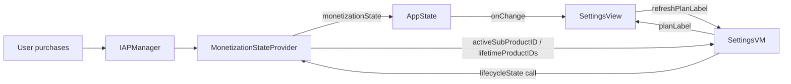

## 改动范围

仅改 FIREprint 项目内，Shared 层不动。

### 1. 付费页卡片顺序：月 → 年 → 一次性

文件 [FIREprintBillingConfig.swift L96](Projects/FIREprint_App/ios_workspace/FIREprint/App/FIREprintBillingConfig.swift)：

```swift
productIDs: [FIREprintBilling.yearlyProductID, FIREprintBilling.monthlyProductID, FIREprintBilling.lifetimeProductID],
```

改为：

```swift
productIDs: [FIREprintBilling.monthlyProductID, FIREprintBilling.yearlyProductID, FIREprintBilling.lifetimeProductID],
```

Shared 层 [ComparisonPaywallView L78](Shared/Sources/MyAppIAP/PaywallUI/ComparisonPaywallView.swift) 按数组顺序渲染，lifetime 仍是最后一个，继续保留 "Best Value" 徽章。

### 2. 设置页显示具体套餐名

#### 2.1 `SettingsVM` 增加套餐标签

文件 [SettingsVM.swift](Projects/FIREprint_App/ios_workspace/FIREprint/ViewModels/SettingsVM.swift)：

- 新增 `var planLabel: String = NSLocalizedString("settings.free_user", ...)` 
- 新增 async 函数 `refreshPlanLabel()`，调 `AppDependencies.shared.monetizationStateProvider.lifecycleState()` 拿 `activeSubscriptionProductID` 和 `lifetimeProductIDs`，按优先级映射：
  - 已买断（`lifetimeProductIDs` 非空）→ `settings.plan.lifetime`（覆盖 `.lifetime` 和 `.subscriberWithLifetime`，买断优先）
  - 活跃订阅 ID == `monthlyProductID` → `settings.plan.monthly`
  - 活跃订阅 ID == `yearlyProductID` → `settings.plan.yearly`
  - 其他（`.freeWithAds`）→ `settings.free_user`

保留 `isPro: Bool`（部分其他地方可能用到）。

#### 2.2 `SettingsView` 换文案

文件 [SettingsView.swift L37-42](Projects/FIREprint_App/ios_workspace/FIREprint/Views/Settings/SettingsView.swift)，把：

```swift
Text(vm.isPro
     ? NSLocalizedString("settings.pro_user", comment: "Pro Member")
     : NSLocalizedString("settings.free_user", comment: "Free"))
```

改为：

```swift
Text(vm.planLabel)
```

并在 `.onAppear` 和 `.onChange(of: appState.monetizationState)` 中 `Task { await vm.refreshPlanLabel() }`。

#### 2.3 新增 3 个本地化 key

`settings.plan.monthly` / `settings.plan.yearly` / `settings.plan.lifetime`，在 15 个 `Localizable.strings` 里加（`en / zh-Hans / zh-Hant / ja / ko / es / fr / pt / ru / ar / ur / hi / bn / id / vi`）。

译文方案：

- en: `Monthly Pro` / `Yearly Pro` / `Lifetime Pro`
- zh-Hans: `Pro 月付` / `Pro 年付` / `终身 Pro`
- zh-Hant: `Pro 月付` / `Pro 年付` / `終身 Pro`
- ja: `Pro 月額` / `Pro 年額` / `永久 Pro`
- ko: `Pro 월간` / `Pro 연간` / `평생 Pro`
- es: `Pro Mensual` / `Pro Anual` / `Pro Permanente`
- fr: `Pro Mensuel` / `Pro Annuel` / `Pro à Vie`
- pt: `Pro Mensal` / `Pro Anual` / `Pro Vitalício`
- ru: `Pro Месячный` / `Pro Годовой` / `Pro Навсегда`
- ar: `برو شهري` / `برو سنوي` / `برو مدى الحياة`
- ur: `Pro ماہانہ` / `Pro سالانہ` / `Pro تاحیات`
- hi: `Pro मासिक` / `Pro वार्षिक` / `Pro आजीवन`
- bn: `Pro মাসিক` / `Pro বার্ষিক` / `Pro আজীবন`
- id: `Pro Bulanan` / `Pro Tahunan` / `Pro Seumur Hidup`
- vi: `Pro Hàng Tháng` / `Pro Hàng Năm` / `Pro Trọn Đời`

保留旧 key `settings.pro_user` / `settings.free_user`（向后兼容，未来其它引用继续能用）。

## 数据流



## 构建 + 提交

按 CLAUDE.md：

```bash
cd Projects/FIREprint_App/ios_workspace
xcodebuild -project FIREprint.xcodeproj -scheme FIREprint \
  -destination 'generic/platform=iOS' -configuration Debug build 2>&1 | tail -30
```

通过后提交：

```
feat(FIREprint): reorder paywall to Monthly/Yearly/Lifetime and show specific plan label in settings
```

## 不改动的部分

- Shared 层（`MonetizationConfiguration` / `MonetizationStateProvider` / `ComparisonPaywallView`）
- `FIREprintBilling.isPaidUser`、`featureProductMapping`、`iapConfiguration.productIDs`
- storekit 文件、ASC 配置