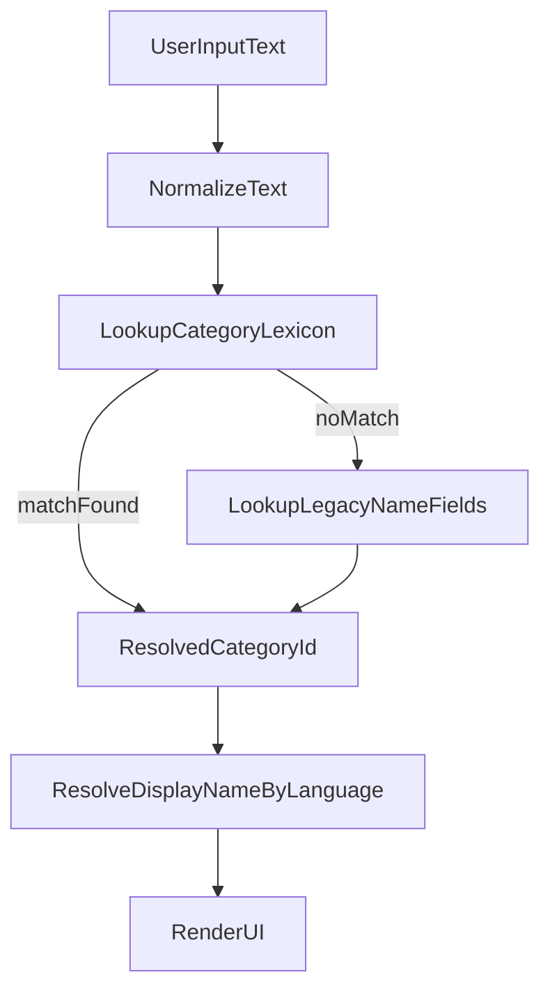

# Fireprint 分类多语言兼容方案

## 目标
- 继续兼容当前中英实现（不改坏历史数据、不影响现有 UI 展示）。
- 支持用户为同一分类添加任意语言名称（如 ja/ko/es/...）。
- 支持用户维护“外部名称 -> 本地分类”的可复用映射（导入/语音均可复用）。
- 逐步替换对 `name`（中文主键式用法）的强依赖，降低未来多语言成本。

## 现状关键点
- 分类模型在 [`Projects/FIREprint_App/ios_workspace/FIREprint/Models/Category.swift`](Projects/FIREprint_App/ios_workspace/FIREprint/Models/Category.swift) 使用 `name`、`nameZh`、`nameEn`，`localizedName` 目前是“中文 vs 非中文”二分。
- 导入匹配在 [`Projects/FIREprint_App/ios_workspace/FIREprint/Domain/CategoryMapper.swift`](Projects/FIREprint_App/ios_workspace/FIREprint/Domain/CategoryMapper.swift) 主要按 `cat.name` 匹配。
- 分类管理在 [`Projects/FIREprint_App/ios_workspace/FIREprint/ViewModels/CategoryManagerVM.swift`](Projects/FIREprint_App/ios_workspace/FIREprint/ViewModels/CategoryManagerVM.swift) 仅写当前语种字段。
- 语言切换在 [`Projects/FIREprint_App/ios_workspace/FIREprint/Infrastructure/LanguageManager.swift`](Projects/FIREprint_App/ios_workspace/FIREprint/Infrastructure/LanguageManager.swift)。

## 推荐方案（兼容 + 渐进）
### 1) 新增“多语言与别名映射层”（不替代旧字段）
- 新建 SwiftData 模型（示例）`CategoryLexicon`：
  - `id`
  - `categoryId`（关联 `Category`）
  - `languageCode`（如 `zh-Hans`、`en`、`ja`）
  - `text`
  - `kind`（`display` / `alias`）
  - `source`（`system` / `user` / `import`）
  - `normalizedText`（小写、去空白等归一化）
- 语义：
  - `display` 用于该语言下优先显示名；
  - `alias` 用于搜索、导入匹配、语音匹配。

### 2) 展示策略改为“新层优先 + 旧字段兜底”
- 在 `Category` 增加统一解析函数（如 `displayName(for:)`）：
  1. 先查 `CategoryLexicon(kind=display, languageCode=currentLanguage)`
  2. 再查同语种主语言（`ja-JP -> ja`）
  3. 再走当前 `nameZh/nameEn/name` 回退链（保持旧逻辑）
- 这样即使不录入任何新翻译，也保持今天的行为。

### 3) 匹配策略统一为“词典匹配”，替代 `name` 硬依赖
- 在 [`Projects/FIREprint_App/ios_workspace/FIREprint/Domain/CategoryMapper.swift`](Projects/FIREprint_App/ios_workspace/FIREprint/Domain/CategoryMapper.swift)：
  - 将可匹配词扩展为：`name` + `nameZh` + `nameEn` + `CategoryLexicon(alias/display)`。
  - 先 exact，再 normalized exact，最后可选轻量模糊（前缀/编辑距离阈值）。
- 在 [`Projects/FIREprint_App/ios_workspace/FIREprint/ViewModels/VoiceRecordVM.swift`](Projects/FIREprint_App/ios_workspace/FIREprint/ViewModels/VoiceRecordVM.swift)：
  - 传给 AI 的可用分类名改为“当前语言 display + 常见 alias”，并在回填时按词典匹配 `categoryId`。

### 4) 用户入口设计（最小改动优先）
- 在 [`Projects/FIREprint_App/ios_workspace/FIREprint/Views/Settings/CategoryManagerView.swift`](Projects/FIREprint_App/ios_workspace/FIREprint/Views/Settings/CategoryManagerView.swift) 的“编辑分类”里增加：
  - `多语言名称`（按语言增删）
  - `别名`（可多条）
- 在导入映射页 [`Projects/FIREprint_App/ios_workspace/FIREprint/Views/Settings/ImportView.swift`](Projects/FIREprint_App/ios_workspace/FIREprint/Views/Settings/ImportView.swift)：
  - 增加“记住本次映射为别名”开关；勾选后写入 `CategoryLexicon(kind=alias, source=import)`。

### 5) 数据迁移（一次性）
- 启动时迁移：
  - 把 `nameZh/nameEn/name` 回填为初始 `CategoryLexicon(display/system)`（避免空词典）。
  - 保持原字段不删，仅作为兼容层。
- CloudKit 同步：
  - 先本地可用（M1）；
  - 再扩展共享同步（M2），避免一次性改动过大。

## 分阶段里程碑
- M1（低风险）：本地词典模型 + 展示回退 + 分类管理编辑入口。
- M2（业务收益）：导入映射写 alias，导入自动匹配命中率提升。
- M3（体验增强）：语音与统计筛选统一词典；清理 `name` 强依赖。

## 流程图

## 关键收益
- 不推翻旧字段，历史数据与现有展示立即兼容。
- 用户可按自己语言习惯维护分类，不受你预设语种限制。
- 导入/语音/搜索共享同一映射层，减少“看得懂但匹配不到”的问题。
- 后续新增语种无需改数据库字段（不再每加一种语言就加一列）。