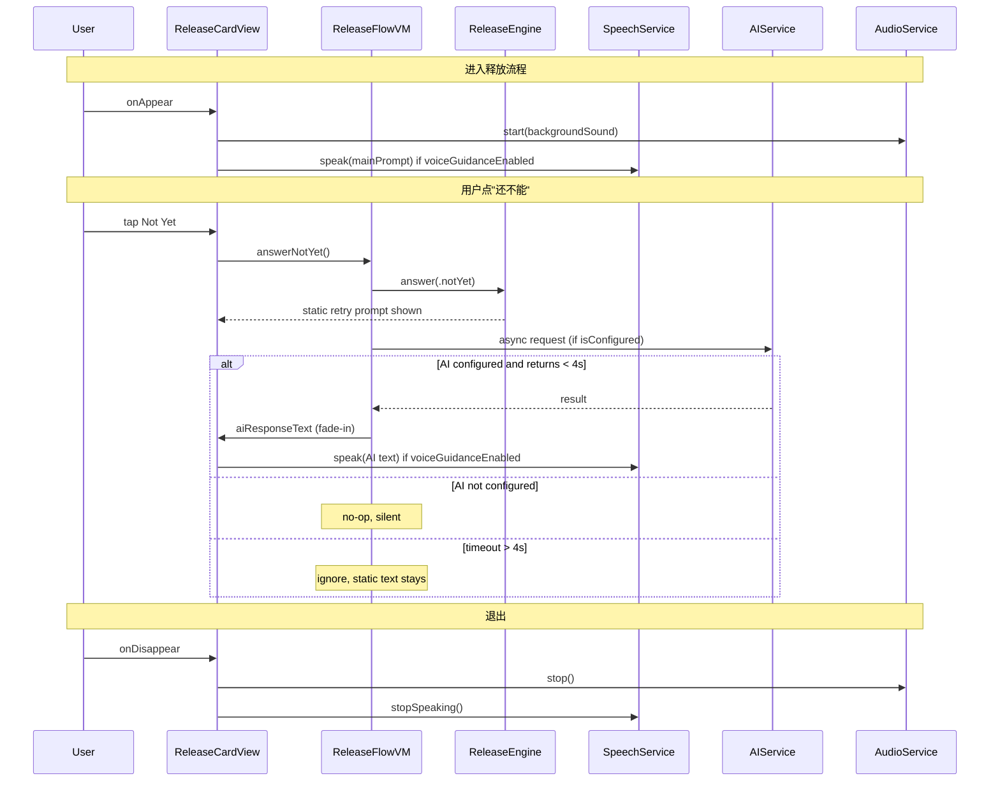

## 1. SwiftData schema 改名

[Projects/InnerRelease_App/ios_workspace/InnerRelease/Models/UserSettings.swift](Projects/InnerRelease_App/ios_workspace/InnerRelease/Models/UserSettings.swift)

- `aiVoiceEnabled: Bool = false` → `voiceGuidanceEnabled: Bool = false`
- `init()` 内同步改名
- 注释 `// AI voice guidance` → `// Voice guidance (system TTS)`
- 保持其他字段不变（`voiceTypeRaw`、`voiceSpeed`、`backgroundSoundRaw`、`backgroundSoundVolume` 复用）

注意：这是 SwiftData + CloudKit schema 变更，模拟器需卸载重装才能生效（和上次 CloudKit 修复同样的流程）。grep 结果显示 `aiVoiceEnabled` 在整个项目里**只有** `UserSettings.swift` 一处引用，迁移风险低。

## 2. App 级单例与环境注入

[Projects/InnerRelease_App/ios_workspace/InnerRelease/App/InnerReleaseApp.swift](Projects/InnerRelease_App/ios_workspace/InnerRelease/App/InnerReleaseApp.swift)

新增两个 `@State` 单例挂到环境：

- `@State private var audioService = AudioService.shared`（复用现成）
- `@State private var speechService = SpeechService.shared`（复用现成）
- `@State private var aiService = AIService.shared`（复用现成）

在 `WindowGroup` 内通过 `.environment(audioService) / .environment(speechService) / .environment(aiService)` 注入，供下游 View / VM 统一访问。

## 3. 背景音接入（ReleaseFlow 生命周期驱动）

修改 `ReleaseFlowContainer`（包住 Standard / Quick / Deep / Goal / ProsCons 的外壳，按 Glob 可能是 `Views/Release/ReleaseFlowContainer.swift` 或相邻文件，开工前先确认真实文件名）：

- `.onAppear { audioService.start(source: settings.backgroundSound, volume: settings.backgroundSoundVolume) }`
- `.onDisappear { audioService.stop() }`
- `.onChange(of: settings.backgroundSoundVolume) { audioService.setVolume($0) }` —— 音量热更新
- `.onChange(of: settings.backgroundSoundRaw) { audioService.switchSource($0) }` —— 换声源

条件：`backgroundSound != .none` 才启动。`AVAudioSession` 使用 `.ambient` 类别（`AudioService` 已经是这样），不打断外部音乐。

## 4. TTS 自动朗读（5-step Standard + Deep + Goal）

新建复用逻辑 `SpeakStepModifier`（或直接 in-view 方法）绑定到三处：
- [Views/Release/ReleaseCardView.swift](Projects/InnerRelease_App/ios_workspace/InnerRelease/Views/Release/ReleaseCardView.swift)
- Deep 模式视图（按 Glob 里的 `ProsConsReleaseView.swift` 与 `AIChatReleaseView.swift` 或其他 Deep/Goal 视图，开工时定位精确文件）
- Goal 模式视图（同上）

触发点（以 `ReleaseCardView` 为例）：
- `.onChange(of: engine.currentStep)` 切换 step 时：若 `settings.voiceGuidanceEnabled == true`，读 `vm.currentStepContent.mainPrompt`
- `.onChange(of: vm.aiResponseText)` AI 气泡出现时：若非空，接着读 AI 文案（排队而非打断）
- `.onDisappear` 取消未完成的朗读

`SpeechService` 已经用 `AVSpeechSynthesizer` + `AVSpeechSynthesisVoice.speechVoices()` 动态选声（**非硬编码 13 种语言**，系统内装了什么语言的声音就有什么），按 `settings.voiceSpeed / voiceTypeRaw` 配置速率和性别偏好即可。

默认 `voiceGuidanceEnabled = false` —— 默认静音、默认不读。

## 5. 右上 Toolbar 静音切换按钮

[Views/Release/ReleaseCardView.swift](Projects/InnerRelease_App/ios_workspace/InnerRelease/Views/Release/ReleaseCardView.swift)

在现有的 `.toolbar` 里（或新增一个 `.toolbar(.topBarTrailing)`）加一个 `Button`：
- 图标：`speaker.wave.2.fill`（开）/ `speaker.slash.fill`（关）
- 点击：`settings.voiceGuidanceEnabled.toggle()` + 持久化
- 关闭时立即 `speechService.stopSpeaking()`
- HapticManager.light() 反馈

## 6. AI "Not Yet" 陪伴（零死等 + 4s 超时）

[Projects/InnerRelease_App/ios_workspace/InnerRelease/ViewModels/ReleaseFlowVM.swift](Projects/InnerRelease_App/ios_workspace/InnerRelease/ViewModels/ReleaseFlowVM.swift) 的 `answerNotYet()` 改造：

```swift
func answerNotYet() {
    engine.answer(.notYet)   // 先走原引擎逻辑（立刻显示静态 retry 文案）
    
    guard aiService.isConfigured else { return }   // 未配置：彻底静默
    
    let step = engine.currentStep
    let retry = engine.retryCountForCurrentStep
    let snapshotAIText = aiResponseText
    
    Task {
        do {
            let result = try await withTimeout(seconds: 4) {
                try await aiService.generateNotYetCompanionship(
                    step: step, retryIndex: retry, ...
                )
            }
            // 静态文案已显示、AI 成功返回 → 淡入替换
            await MainActor.run {
                withAnimation(.easeInOut(duration: 0.3)) {
                    aiResponseText = result
                }
                usedAIGuidance = true   // 记录在 ReleaseRecord
            }
        } catch {
            // 超时 / 失败：不替换，用户继续读静态文案，无感
        }
    }
}
```

配套改动 [Views/Release/ReleaseCardView.swift](Projects/InnerRelease_App/ios_workspace/InnerRelease/Views/Release/ReleaseCardView.swift) AI 气泡（第 68-79 行）顶部加小字标签：

```swift
if let aiText = vm.aiResponseText {
    VStack(alignment: .leading, spacing: 4) {
        Label("AI Guidance", systemImage: "sparkles")
            .font(.caption2)
            .foregroundStyle(.secondary)
        Text(aiText).font(.themeCallout)...
    }
    .transition(.opacity)   // 配合 withAnimation 的淡入淡出
}
```

关键行为：
- AI 未配置 → 完全不显示气泡、不显示 loading、不显示 "AI Guidance" 标签，UX 和今天一模一样
- AI 成功 → 静态文案先出，2-5s 后 AI 气泡淡入出现在静态文案下方（或替换）
- AI 超时 > 4s → 放弃替换，静态文案保持
- Session 级速率：同一次 release 一个 step 内最多调用 1 次

新增 `Localizable.strings` key：`ai.guidance.label = "AI Guidance"` / `"AI 引导"`

## 7. Settings UI 文案微调

[Views/Settings/SettingsView.swift](Projects/InnerRelease_App/ios_workspace/InnerRelease/Views/Settings/SettingsView.swift) 和相关 loc key：

- "AI 语音引导" / "AI Voice Guidance" → "朗读引导" / "Voice Guidance"
- toggle 绑定字段改名同步到 `voiceGuidanceEnabled`
- footer 补一行小字说明：使用 iOS 系统语音（不产生网络流量），可在 iOS 设置 > 辅助功能 > 口说内容 添加更多语音

## 8. ReleaseRecord 记录 AI 使用

`usedAIGuidance` 字段已存在于 [Models/ReleaseRecord.swift](Projects/InnerRelease_App/ios_workspace/InnerRelease/Models/ReleaseRecord.swift)，在 `ReleaseFlowVM` 的 AI 成功回调里置 true，`saveRecord` 时一并持久化。

## 9. 数据流图



## 10. 验证步骤

1. `xcodegen generate` → `xcodebuild build` 编译通过
2. 模拟器卸载旧 app（schema 变了），重装
3. 默认设置：进入 release 无语音、无背景音、点"Not Yet"只显示静态文案（AI 未配）
4. 开启 voiceGuidance → 每步自动朗读
5. 开启背景音 → 进入有淡入环境音，退出淡出
6. 右上静音按钮 → 立即停止当前朗读
7. 配置一个 AI provider（如 Gemini）→ 点 "Not Yet" → 2-5s 后 AI 气泡淡入