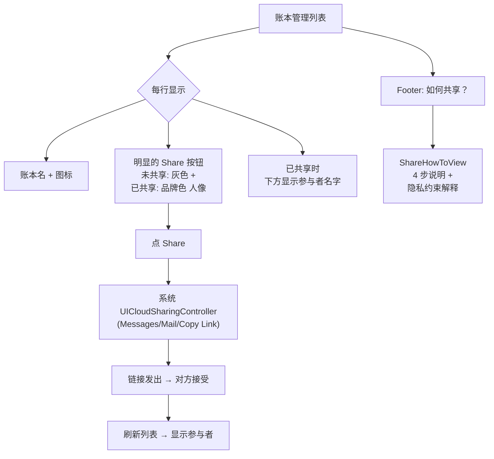

# 账本共享 UI 改进

## 背景约束（不能违反）

- Apple CloudKit **禁止** App 输入/收集对方 Apple ID；唯一合法的邀请通道是系统 `UICloudSharingController` + Messages/Mail/Copy Link
- 现有代码的 `CloudKitShareManager` + `CloudSharingView` 已实现这条正确路径，**无需改动共享底层**，只改 UI 入口与展示

## 要改的文件

### 1. `[LedgerManagerView.swift](Projects/FIREprint_App/ios_workspace/FIREprint/Views/Settings/LedgerManagerView.swift)` 每行加明显共享按钮 + 参与者预览

当前左滑入口改为行尾显式按钮；参与者名字在行下方 inline 展示：

- 在每个 ledger 行的右侧（`isDefault` 胶囊之前或之后）加一个 `person.crop.circle.badge.plus` / `person.2.fill` 图标按钮：
  - 未共享：图标灰色，点击 → 走现有 `startSharing(ledger)` 创建分享并弹 `CloudSharingView`
  - 已共享：图标品牌色，点击 → 走现有 `startSharing(ledger)`（代码已能识别已存在的 share 并进入管理模式）
- 行下方（仅当 `ledger.isShared == true` 且有参与者）展示参与者头像条：
  - 复用 `[ShareInviteView.swift:261-268](Projects/FIREprint_App/ios_workspace/FIREprint/Views/Settings/ShareInviteView.swift)` 的 `participantDisplayName` 逻辑
  - 最多显示 3 个名字 + 省略号（"Alice, Bob 等 3 人"）
- 保留左滑的 Share 作为备选入口（可选；若嫌重复可移除）

### 2. 新增参与者数据加载逻辑

在 `LedgerManagerView` 里加：

- `@State private var sharedLedgerData: [UUID: [CKShare.Participant]]` 
- `loadSharedLedgerInfo()` async 方法，模仿 `[ShareInviteView.swift:295-315](Projects/FIREprint_App/ios_workspace/FIREprint/Views/Settings/ShareInviteView.swift)` 的实现（遍历 `isShared` 账本 → `findLedgerRecord` → `fetchShare` → 取 `share.participants`）
- `.onAppear` 和 `showSharingSheet` 关闭的 `onDismiss` 回调里都调用一次

### 3. 新增「如何共享」说明页

新增文件 `[ShareHowToView.swift](Projects/FIREprint_App/ios_workspace/FIREprint/Views/Settings/ShareHowToView.swift)`：

- SwiftUI 页面，用 `Step` 形式说明 4 步流程：
  1. 点账本旁共享按钮
  2. 选择 Messages/Mail/复制链接
  3. 把链接发给对方
  4. 对方点链接用自己 iCloud 账号接受
- 额外一段澄清文案：**"Apple 不允许 App 直接输入对方的 Apple ID，这是系统级隐私保护，所有 iCloud 共享都走链接邀请"**
- 入口：在 `LedgerManagerView` 的 "Ledger Sharing" Section 的 footer 旁加一个 "如何共享？" 文字链接，点进 `ShareHowToView`；同时 `ShareInviteView` 顶部也加一个 info 图标入口到同一页

### 4. 国际化字符串

`[zh-Hans.lproj/Localizable.strings](Projects/FIREprint_App/ios_workspace/FIREprint/Resources/zh-Hans.lproj/Localizable.strings)` 和 `[en.lproj/Localizable.strings](Projects/FIREprint_App/ios_workspace/FIREprint/Resources/en.lproj/Localizable.strings)` 新增：

- `share.how_to.title`、`share.how_to.step1..4`、`share.how_to.privacy_note`
- `share.participants_summary_format`（"{names} · 共 {count} 人"）
- `share.button.invite`、`share.button.manage`

其他语言文件 fallback 到 en（现有做法，不补齐）

## 交互流程图

## 不动的东西

- `CloudKitShareManager.swift` 完全不改
- `CloudSharingView.swift` 完全不改
- 数据模型、entitlements、Info.plist 都不改
- CKError 15 是配置问题（App ID ↔ 容器绑定 / profile），在这个计划之外单独解决

## 验证步骤

1. `xcodegen` 重新生成工程（因新增 `ShareHowToView.swift`）
2. `xcodebuild ... build` 确认编译通过
3. 真机测试：
   - 打开账本管理 → 每行可见 Share 按钮
   - 点 Share → 弹系统 UICloudSharingController（验证前提是 CKError 15 已解决）
   - 分享成功后返回列表 → 看到参与者名字 inline 显示
   - 点 Footer 的 "如何共享？" → 打开说明页
4. git commit: `feat(FIREprint): visible ledger share button + participants preview + how-to page`