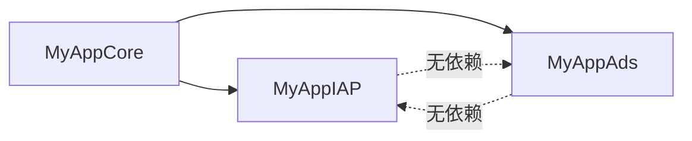

## 背景 & 结论

`MyAppBilling` 目前把"付费 (IAP/Paywall/Quota/Rating/Monetization)"和"广告 (Ads)"放在同一个 library target 里。InnerRelease 是纯付费 App，不需要 Ads 抽象层。经过分析，耦合点其实非常小：

- `Ads/*` 只依赖 Foundation / SwiftUI / MyAppCore，**无任何第三方广告 SDK**
- 除 `Ads/*` 自身外，只有 `Common/BillingConfiguration.swift`、`Common/BillingError.swift`、`Common/AnalyticsEventReporter.swift` 三个文件出现 `Ad*` 类型引用
- `Monetization/*` 的枚举里出现了 `freeWithAds` 等命名（语义硬编码），但**不引用任何 `Ad*` 类型**，保留即可（纯付费 App 把 `.freeWithAds` 当"未付费"语义用，无需改动）
- `Paywall/*`、`PaywallUI/*`、`Quota/*`、`Rating/*`、`IAP/*` 完全不引用 `Ad*`

因此采用"拆目录 + 拆 Package target + 配置类解耦"的方式，以最小改动实现 C 方案。

## 目标产物

拆分后 `Shared/Package.swift` 将新增 2 个 library、移除 1 个（`MyAppBilling`）：

- `MyAppIAP`  — 付费核心：IAP / Paywall / PaywallUI / Quota / Rating / Monetization / Common（无 Ad）/ Resources
- `MyAppAds`  — 广告抽象：Ads/* + 对应错误 + 对应 AnalyticsEventReporter 扩展

## 关键设计决策

### 1. `BillingConfiguration` 怎么办

原 `BillingConfiguration` 同时聚合了 IAP 和 Ad 配置，不适合放在任何一边。处理方式：

- 在 `MyAppIAP` 里新增 `IAPBillingConfiguration`（不含 `ad` 字段），这是 InnerRelease 直接使用的
- 在 `MyAppAds` 里独立定义 `AdsConfiguration`（包一层 `AdConfiguration` + `AdPolicy` 等，方便未来扩展）
- SilenceCut 在 app 层各自构造两个 config 分别注入；保留 `IAPBillingConfiguration` 里的 `paywallConfigProvider` / `quota` / `rating` / `monetization` / `analyticsReporter` 字段以保持向后兼容 API

### 2. `BillingError` 怎么办

原 `BillingError` 的 `.ad(AdError)` case 是唯一的 Ads 耦合点：

- `MyAppIAP/Common/BillingError.swift` 保留 `.iap` / `.quota` / `.paywall` 三个 case，移除 `.ad`
- `MyAppAds/AdError.swift` 独立定义 `AdError`（不再嵌套在 Billing 内），同时提供顶层 `AdOperationError` enum 满足需要统一错误码的场景
- SilenceCut 里目前没有直接拼接 `BillingError.ad(...)` 的代码，影响面基本为零

### 3. `AnalyticsEventReporter` 协议怎么办

原协议同时声明 `reportBillingEvent` / `reportAdEvent` / `reportPaywallEvent`：

- `MyAppIAP` 里保留 `AnalyticsEventReporter` 但只含 `reportBillingEvent` + `reportPaywallEvent`
- `MyAppAds` 里新增独立 `AdAnalyticsReporter` 协议（仅 `reportAdEvent`）
- 上层 Analytics 实现同时 conform 两个协议即可

### 4. 文件物理位置

从 `Shared/Sources/MyAppBilling/` 拆分为：

```
Shared/Sources/
├── MyAppIAP/                          (原 MyAppBilling 除 Ads)
│   ├── Common/
│   │   ├── IAPBillingConfiguration.swift    (原 BillingConfiguration 去掉 ad 字段)
│   │   ├── BillingError.swift                (去掉 .ad case)
│   │   └── AnalyticsEventReporter.swift      (去掉 reportAdEvent)
│   ├── IAP/            (原样迁入)
│   ├── Paywall/        (原样迁入)
│   ├── PaywallUI/      (原样迁入)
│   ├── Quota/          (原样迁入)
│   ├── Rating/         (原样迁入)
│   ├── Monetization/   (原样迁入)
│   └── Resources/      (原样迁入)
└── MyAppAds/                          (全新 target)
    ├── Ads/            (原 MyAppBilling/Ads/* 全部迁入)
    ├── Common/
    │   ├── AdError.swift                     (顶层化)
    │   └── AdAnalyticsReporter.swift         (新协议)
    └── AdsConfiguration.swift                (聚合 config)
```

`Shared/Tests/MyAppBillingTests/` 按照类似方式拆成 `MyAppIAPTests/` + `MyAppAdsTests/`（现有 `IAPAuditLoggerTests` 归 IAP、目前无 Ad 测试）。

### 5. 依赖方向



`MyAppIAP` 与 `MyAppAds` 互不依赖，都仅依赖 `MyAppCore`。

## 迁移影响矩阵

- **InnerRelease** (`[Projects/InnerRelease_App/ios_workspace/project.yml](Projects/InnerRelease_App/ios_workspace/project.yml)`)：在现有 `- package: Shared / product: MyAppCore` 之外加 `product: MyAppIAP`；不依赖 `MyAppAds`
- **SilenceCut** (`[Projects/SilenceCut_App/ios_workspace/SilenceCut/Package.swift](Projects/SilenceCut_App/ios_workspace/SilenceCut/Package.swift)`)：把原本 `MyAppBilling` 依赖替换为 `MyAppIAP` + `MyAppAds` 两个 product
  - `[SilenceCutBillingConfig.swift](Projects/SilenceCut_App/ios_workspace/SilenceCut/Sources/SilenceCut/App/SilenceCutBillingConfig.swift)`：`import MyAppBilling` → `import MyAppIAP` + `import MyAppAds`
  - 其他 6-10 个业务文件批量 `import MyAppBilling` → `import MyAppIAP`（大部分只用到 IAP/Paywall/Quota/Monetization），只有真正用到 `AdManager`/`AdPolicy` 的文件另加 `import MyAppAds`
- **Shared 文档**：`[Docs/详细设计_MyAppBilling.md](Docs/详细设计_MyAppBilling.md)` 和 `[Docs/Shared_Integration_Guide_4_AI.md](Docs/Shared_Integration_Guide_4_AI.md)` 轻量更新（可留到第 5 步一起做）

## 实施顺序

每一步都要**可编译**（SilenceCut 不能因 Shared 拆分而长时间坏掉）。采取"先加新、验证、再切换、最后删旧"的策略。

## 不做的事

- 不拆分 `MonetizationState`：`freeWithAds` 等枚举值保持原样，InnerRelease 用 `.trial` / `.subscriber` / `.freeWithAds`（语义：未付费）即可
- 不替换第三方 SDK / 不动 SilenceCut 的 TopOn / Admob 适配代码
- 不改 Resources 本地化字符串（Paywall 文案在 IAP 侧）
- 不保留 `MyAppBilling` 兼容别名（避免长期双名），SilenceCut 一次性切过去
