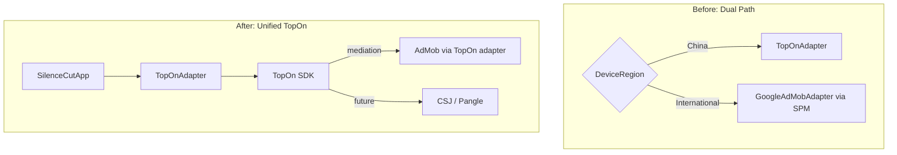

# TopOn 统一广告管理方案

## 现状问题

- `TPNMediationGoogleAdapter` 在 CocoaPods 上**不存在**，Podfile 中的声明无效
- TopOn 的 Google adapter 需要从 [TopOn SDK Download Center](https://portal.toponad.com/m/sdk/download) **手动下载** xcframework
- 当前双通路架构 (中国走 TopOn / 海外走 standalone AdMob) 导致中国测试时 rewarded 全部失败

## 目标架构

所有区域统一通过 TopOn adapter，TopOn 后台配置 AdMob 作为 mediated network。删除独立的 GoogleAdMobAdapter 通路。



## 手动步骤 (需要你在代码变更前完成)

1. 登录 [TopOn SDK Download Center](https://portal.toponad.com/m/sdk/download)
2. 选择平台: **iOS**, 选择广告平台: **Google AdMob**
3. 点击"生成接入代码"，下载 ZIP，解压得到 `AnyThinkAdmobAdapter.xcframework`
4. 将 xcframework 拖入 Xcode 项目的 `SilenceCutApp/` 目录下
5. 确认 TopOn 后台 rewarded placement (`n69bffe52aab9f`) 的 AdMob ad source 配置正确

## 代码变更

### 1. Podfile — 清理无效 pod，添加 Google-Mobile-Ads-SDK

文件: [Podfile](Projects/SilenceCut_App/ios_workspace/Podfile)

- 删除不存在的 `pod 'TPNMediationGoogleAdapter'`
- 添加 `pod 'Google-Mobile-Ads-SDK'` (TopOn Google adapter 的运行时依赖)

### 2. project.yml — 移除 SPM GoogleMobileAds

文件: [project.yml](Projects/SilenceCut_App/ios_workspace/project.yml)

- 从 `packages` 中移除 `GoogleMobileAds` (SPM)
- 从 target `dependencies` 中移除 `GoogleMobileAds` (SPM)
- 保留 `GoogleUserMessagingPlatform` (UMP 用于 GDPR，和广告 SDK 独立)

### 3. SilenceCutApp.swift — 移除双通路，统一走 TopOn

文件: [SilenceCutApp.swift](Projects/SilenceCut_App/ios_workspace/SilenceCutApp/SilenceCutApp.swift)

- 移除 `import GoogleMobileAds`
- 移除 `lazy var adMobAdapter = GoogleAdMobAdapter()`
- `initializeAds()` 中移除 `DeviceRegion.isMainlandChina` 分支，所有区域都用 `TopOnAdapter`
- 使用 `topOnPlacementIDs` 作为 adUnitIDs (不再有 standalone adUnitIDs)
- 保留 UMP 隐私流程 (仍由 `DeviceRegion.isMainlandChina` 控制是否跳过)

### 4. GoogleAdMobAdapter.swift — 删除

文件: [GoogleAdMobAdapter.swift](Projects/SilenceCut_App/ios_workspace/SilenceCutApp/GoogleAdMobAdapter.swift)

不再需要，TopOn 统一处理 AdMob 的 load/show/banner 逻辑。

### 5. SilenceCutBillingConfig.swift — 清理无用配置

文件: [SilenceCutBillingConfig.swift](Projects/SilenceCut_App/ios_workspace/SilenceCut/Sources/SilenceCut/App/SilenceCutBillingConfig.swift)

- 保留 `topOnPlacementIDs` 和 `topOnNetworkRollout`
- 保留 standalone `adUnitIDs` 和 `testAdUnitIDs` 作为参考/备用，可标注 deprecated

### 6. 重新生成项目 & 安装 Pods

```bash
cd Projects/SilenceCut_App/ios_workspace
~/.mint/bin/xcodegen generate
pod install
open SilenceCut.xcworkspace
```

## 注意事项

- `Google-Mobile-Ads-SDK` CocoaPods 版本与 SPM 版本是同一个 SDK，只是分发渠道不同。最新版可直接用
- TopOn adapter 手动下载的 xcframework 需要加入 Xcode target 的 "Frameworks, Libraries, and Embedded Content"
- TopOn 后台的 AdMob ad source 需要配置正确的 App ID 和 Ad Unit ID (已配: `ca-app-pub-5101769973032466/8537229166`)
- banner 广告的 TopOn placement ID 也已配好，不受影响
